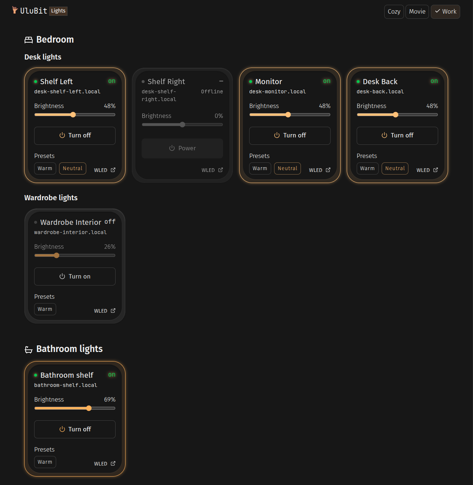

#  UluBit Lights Dashboard

A local dashboard for controlling and managing the lights around my home.

Built with [Astro](https://astro.build/) and designed to communicate directly with WLED devices over the local network.



## Features

* View WLED devices by room and area
* Turn individual lights on and off
* Control brightness
* Apply WLED presets
* Apply scenes across multiple lights
* Show device connection status
* Reflect the current light color in the interface

## Stack

* Astro
* TypeScript
* WLED JSON API
* UluBit UI components

## Development

Install dependencies:

```sh
pnpm install
```

Start the development server:

```sh
pnpm dev
```

To expose the dashboard to other devices on the local network:

```sh
pnpm dev --host
```

## Hosting

The dashboard is intended to run continuously on a dedicated Redmi Note 12 using Termux, making it accessible to devices on the local network without requiring my main computer to be running.

## Scope

This project is intentionally focused on lighting rather than general home automation. WLED devices, presets, scenes, and related lighting controls belong here.